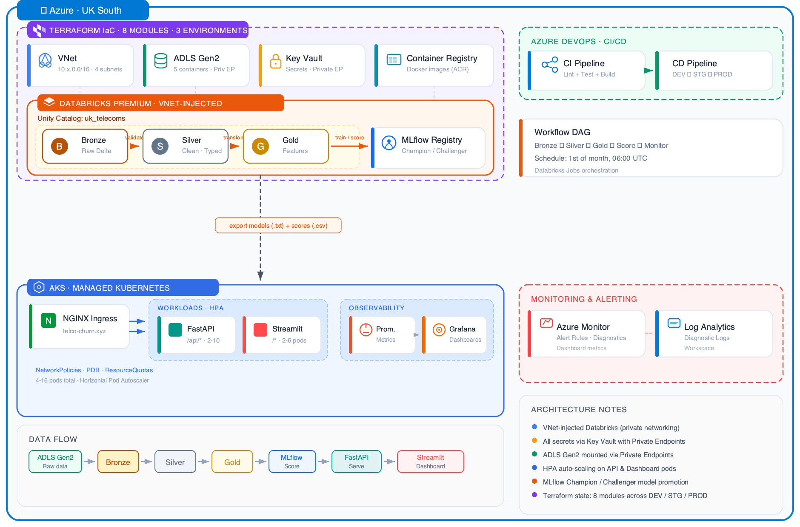

# Low-Level Design — Telco Customer Churn Prediction Platform

> **Document Type:** Low-Level Design (LLD)
> **Version:** 1.0
> **System:** UK Telecoms Broadband Churn Prediction — Multi-Horizon ML Platform
> **Stack:** Azure · Databricks · Spark · LightGBM · AKS · FastAPI · Streamlit

---

## Table of Contents

1. [System Overview](#1-system-overview)
2. [Infrastructure Layer (Azure + Terraform)](#2-infrastructure-layer)
3. [Networking & Security](#3-networking--security)
4. [Data Layer (Medallion Architecture)](#4-data-layer)
5. [ML Pipeline](#5-ml-pipeline)
6. [Serving Layer (AKS)](#6-serving-layer)
7. [Observability & Monitoring](#7-observability--monitoring)
8. [CI/CD Pipelines](#8-cicd-pipelines)
9. [Configuration Management](#9-configuration-management)
10. [Testing Strategy](#10-testing-strategy)
11. [Data Flow Diagrams](#11-data-flow-diagrams)
12. [API Contracts](#12-api-contracts)
13. [Failure Modes & Recovery](#13-failure-modes--recovery)

---

## 1. System Overview

### 1.1 Problem

UK Telecoms LTD predicts which broadband customers will churn (place a cease order) across **three time horizons** (30/60/90 days). Each horizon maps to a business action tier:

| Horizon | Risk Tier | Action | Owner | SLA |
|---------|-----------|--------|-------|-----|
| 30-day | RED | Emergency outbound call, best-offer retention deal | Call center (Loyalty) | 24 hours |
| 60-day | AMBER | Targeted digital campaign, proactive contract renewal | CRM / Marketing | 7 days |
| 90-day | YELLOW | Customer success check-in, experience improvement | Customer Success | 30 days |
| Below all | GREEN | No action — continue monitoring | Automated | N/A |

### 1.2 Data Scale

| Dataset | Rows | Size | Grain | Range | Source Format |
|---------|------|------|-------|-------|---------------|
| `customer_info` | 3,545,538 | 270 MB | Customer × Month (26 snapshots) | 2022-08 → 2024-09 | Parquet |
| `usage` | 83,185,050 | 3.1 GB | Customer × Day | 2022-09 → 2024-09 | Parquet |
| `calls` | 628,437 | 59 MB | Call event | 2022-08 → 2024-09 | CSV |
| `cease` | 146,363 | 18 MB | Cease event | 2022-08 → 2024-09 | CSV |

Master entity: `customer_info` (202,782 unique customers). 100% of cease/calls customers exist within it.

### 1.3 End-to-End Architecture



---

## 2. Infrastructure Layer

### 2.1 Terraform Modules

**Root config:** `infrastructure/main.tf`
**Required versions:** Terraform >= 1.5.0, azurerm ~> 3.85, databricks ~> 1.35, azuread ~> 2.47
**Backend:** Azure Storage (remote state in `telcochurntfstate` storage account)

| Module | Path | Resources Created |
|--------|------|-------------------|
| `networking` | `modules/networking/` | VNet, 4 subnets, 3 NSGs |
| `storage` | `modules/storage/` | ADLS Gen2 (HNS), 4 containers (delta, unity-catalog, mlflow-artifacts, checkpoints), private endpoint |
| `landing-storage` | `modules/landing-storage/` | Shared ADLS Gen2 landing account (`telcochurnsalanding`), 1 container. Created once (DEV only), referenced by all environments |
| `key-vault` | `modules/key-vault/` | Key Vault, private endpoint, diagnostic logs |
| `databricks` | `modules/databricks/` | Premium workspace (VNet-injected), service principal, RBAC |
| `access-connector` | `modules/access-connector/` | SystemAssigned identity for UC → ADLS access (per-env + shared landing read) |
| `unity-catalog` | `modules/unity-catalog/` | Catalog, 4 schemas, storage credential, 2 external locations (per-env + shared landing) |
| `acr` | `modules/acr/` | Container Registry (Basic dev/staging, Premium prod with geo-replication) |
| `aks` | `modules/aks/` | K8s cluster, 2 node pools, workload identity, Container Insights |
| `monitoring` | `modules/monitoring/` | Log Analytics, diagnostic settings (Databricks + Storage), alert rules |
| `dns` | `modules/dns/` | DNS zone (conditional, only if `domain_name != ""`) |

### 2.2 Resource Naming Convention

```
Pattern: {prefix}-{component}-{env}

Examples:
  vnet-telco-churn-prod         (VNet)
  snet-dbx-public-prod          (Subnet)
  nsg-aks-prod                  (NSG)
  telcochurnsaprod              (Storage — no hyphens, per-env)
  telcochurnsalanding           (Shared landing storage — all envs)
  telco-churn-dbx-prod          (Databricks workspace)
  telco-churn-kv-prod           (Key Vault)
  telco-churn-la-prod           (Log Analytics)
  telcochurnsacrprod            (ACR — no hyphens)
  telco-churn-aks-prod          (AKS)
  mi-churn-api-prod             (Managed Identity)
```

### 2.3 Environment Matrix

| Property | DEV | STAGING | PROD |
|----------|-----|---------|------|
| **VNet CIDR** | 10.1.0.0/16 | 10.2.0.0/16 | 10.3.0.0/16 |
| **Catalog Name** | uk_telecoms_dev | uk_telecoms_staging | uk_telecoms |
| **Metastore** | Created | Created | Pre-existing (`0ff81767-...`) |
| **Storage Replication** | LRS | LRS | GRS |
| **KV Purge Protection** | Off | Off | On (90-day retention) |
| **KV Soft Delete** | 7 days | 7 days | 90 days |
| **ACR SKU** | Basic | Basic | Premium (geo-replicated to ukwest) |
| **Databricks No Public IP** | false | false | true |
| **AKS K8s Version** | 1.29 | 1.29 | 1.33 |
| **AKS System Pool** | 1-2 × DS2_v2 | 1-3 × DS2_v2 | 2-3 × D2ads_v7 |
| **AKS Workload Pool** | 1-2 × DS2_v2 | 2-5 × DS3_v2 | 2-3 × D2ads_v7 |
| **Log Retention** | 30 days | 30 days | 90 days |
| **Domain** | — | — | telco-churn.xyz |
| **Terraform State Key** | dev.terraform.tfstate | staging.terraform.tfstate | prod.terraform.tfstate |

### 2.4 Storage Accounts (ADLS Gen2)

#### Per-Environment Account: `telcochurnsa{env}`

HNS enabled, TLS 1.2 minimum. Processed data only — no raw source files.

| Container | Access | Contents |
|-----------|--------|----------|
| `delta` | Private | Delta Lake tables (Bronze/Silver/Gold managed tables) |
| `unity-catalog` | Private | Unity Catalog managed storage (catalog data) |
| `mlflow-artifacts` | Private | MLflow experiment artifacts (models, metrics, plots) |
| `checkpoints` | Private | Auto Loader / DLT streaming checkpoints |

Private endpoint: `pe-{storage_account_name}` via `dfs` subresource on private endpoints subnet.

#### Shared Landing Account: `telcochurnsalanding`

Single ADLS Gen2 account (HNS enabled, GRS, TLS 1.2) holding raw source data. Created once by the DEV Terraform run (`create_landing_storage = true`); staging and prod reference it via `data` source. All environments read from the same landing zone — data is uploaded once.

| Container | Access | Contents |
|-----------|--------|----------|
| `landing` | Private | Raw source files (customer_info.parquet, usage.parquet, calls.csv, cease.csv) |

Each environment's access connector gets `Storage Blob Data Contributor` on this account (required for Databricks external location validation).

### 2.5 vCPU Quota Management (PROD)

Azure UK South regional quota: **10 vCPUs total**

| Component | VM Size | vCPUs per Node | Min Nodes | Max Nodes | Min vCPUs | Max vCPUs |
|-----------|---------|----------------|-----------|-----------|-----------|-----------|
| AKS System Pool | D2ads_v7 | 2 | 2 | 3 | 4 | 6 |
| AKS Workload Pool | D2ads_v7 | 2 | 2 | 3 | 4 | 6 |
| **Total** | | | | | **8** | **12** |

**Constraint:** Max burst (12) exceeds quota (10). Safe config: 3 system + 2 workload = 10 vCPUs.
Databricks clusters require temporarily scaling down AKS workload pool to free quota.

---

## 3. Networking & Security

### 3.1 VNet Architecture

```
VNet: 10.{env}.0.0/16
│
├── snet-dbx-public-{env}        10.{env}.1.0/24    Databricks host (public) subnet
│   └── Delegation: Microsoft.Databricks/workspaces
│
├── snet-dbx-private-{env}       10.{env}.2.0/24    Databricks container (private) subnet
│   └── Delegation: Microsoft.Databricks/workspaces
│
├── snet-private-endpoints-{env} 10.{env}.3.0/24    Storage + Key Vault private endpoints
│
└── snet-aks-{env}               10.{env}.4.0/24    AKS node pool subnet
    └── NSG: nsg-aks-{env}
```

Where `{env}` mapping: dev=1, staging=2, prod=3.

### 3.2 AKS NSG Rules

**Inbound:**

| Priority | Name | Port | Source | Action |
|----------|------|------|--------|--------|
| 100 | AllowHTTPSFromKnownIPs | 443 | `var.allowed_ingress_ips` | Allow |
| 110 | AllowHTTPFromKnownIPs | 80 | `var.allowed_ingress_ips` | Allow |
| 120 | AllowAzureLoadBalancer | * | AzureLoadBalancer | Allow |
| 130 | AllowVNetInbound | * | VirtualNetwork | Allow |
| 1000 | DenyAllInbound | * | * | Deny |

**Outbound:**

| Priority | Name | Direction | Purpose |
|----------|------|-----------|---------|
| 100 | AllowInternetOutbound | Outbound | ACR pulls, monitoring, updates |
| 110 | AllowVNetOutbound | Outbound | Private endpoints, inter-service |

### 3.3 Kubernetes Network Policies

**API Pod (`churn-api`):**

```
Ingress:
  FROM: ingress-nginx namespace (via namespaceSelector)
  FROM: churn-dashboard pods (via podSelector)
  PORT: TCP/8000

Egress:
  TO: kube-system/kube-dns (UDP+TCP/53)
  TO: Azure Files (TCP/445, SMB mount)
```

**Dashboard Pod (`churn-dashboard`):**

```
Ingress:
  FROM: ingress-nginx namespace only
  PORT: TCP/8501

Egress:
  TO: kube-system/kube-dns (UDP+TCP/53)
  TO: churn-api pods (TCP/8000)
  TO: Azure Files (TCP/445, SMB mount)
```

### 3.4 AKS Service CIDR

```
Service CIDR:  172.16.0.0/16
DNS Service IP: 172.16.0.10
Network Plugin: Azure CNI
Network Policy: Calico
```

### 3.5 Private Endpoints

| Resource | PE Name | Subresource | Subnet |
|----------|---------|-------------|--------|
| ADLS Gen2 | pe-{storage_account} | dfs | snet-private-endpoints |
| Key Vault | pe-telco-churn-kv-{env} | vault | snet-private-endpoints |

### 3.6 Workload Identity (Pod → Azure)

| Pod | Managed Identity | ServiceAccount | Federated Credential Subject | Roles |
|-----|-----------------|----------------|------------------------------|-------|
| churn-api | mi-churn-api-{env} | churn-api-sa | `system:serviceaccount:telco-churn:churn-api-sa` | KV Secrets User, Storage Blob Data Reader |
| churn-dashboard | mi-churn-dashboard-{env} | churn-dashboard-sa | `system:serviceaccount:telco-churn:churn-dashboard-sa` | Storage Blob Data Reader |

### 3.7 Container Security

Both API and Dashboard Dockerfiles enforce:

- Multi-stage builds (builder + runtime)
- Non-root user (UID 1000)
- Read-only root filesystem
- Drop ALL capabilities, add only `NET_BIND_SERVICE`
- seccompProfile: RuntimeDefault
- No privilege escalation

---

## 4. Data Layer

### 4.1 Unity Catalog Namespace

```sql
Catalog: uk_telecoms  (prod) / uk_telecoms_{env} (dev/staging)
├── bronze    -- Raw Delta tables, no transforms
├── silver    -- Cleaned, typed, validated
├── gold      -- Features, labels, training sets, scores, action lists
└── ml        -- MLflow models (3 horizons × Champion/Challenger)
```

### 4.2 Table Registry

| Schema | Table | Type | Grain | Key Columns |
|--------|-------|------|-------|-------------|
| bronze | raw_customer_info | Delta | Customer × Month | unique_customer_identifier, datevalue |
| bronze | raw_usage | Delta | Customer × Day | unique_customer_identifier, calendar_date |
| bronze | raw_calls | Delta | Call event | unique_customer_identifier, event_date |
| bronze | raw_cease | Delta | Cease event | unique_customer_identifier, cease_placed_date |
| silver | customer_info | Delta | Customer × Month | unique_customer_identifier, datevalue |
| silver | usage_daily | Delta (partitioned by month_key) | Customer × Day | unique_customer_identifier, calendar_date |
| silver | usage_monthly | Delta | Customer × Month | unique_customer_identifier, month_key |
| silver | calls | Delta | Call event | unique_customer_identifier, event_date |
| silver | cease | Delta | Cease event | unique_customer_identifier, cease_placed_date |
| gold | churn_features | Feature Store (Delta) | Customer × Month | unique_customer_identifier, observation_date |
| gold | churn_labels | Delta | Customer × Month | unique_customer_identifier, observation_date |
| gold | churn_training_set | Delta | Customer × Month | unique_customer_identifier, observation_date, split |
| gold | churn_scores | Delta | Customer × Score Date | unique_customer_identifier, score_date |
| gold | action_list_loyalty | Delta | Customer (RED tier) | unique_customer_identifier |
| gold | action_list_marketing | Delta | Customer (AMBER tier) | unique_customer_identifier |
| gold | action_list_customer_success | Delta | Customer (YELLOW tier) | unique_customer_identifier |
| ml | churn_model_30d | MLflow Model (UC) | — | Champion/Challenger aliases |
| ml | churn_model_60d | MLflow Model (UC) | — | Champion/Challenger aliases |
| ml | churn_model_90d | MLflow Model (UC) | — | Champion/Challenger aliases |

### 4.3 Bronze Layer — Notebook 01

**File:** `notebooks/01_bronze_ingestion.py` (213 lines)
**Pattern:** Bulk load from ADLS → Delta (assessment). Production uses Auto Loader via DLT.

```
Source: abfss://landing@telcochurnsalanding.dfs.core.windows.net/  (shared landing account)
  ├── customer_info.parquet  →  uk_telecoms.bronze.raw_customer_info
  ├── usage.parquet          →  uk_telecoms.bronze.raw_usage
  ├── calls.csv              →  uk_telecoms.bronze.raw_calls
  └── cease.csv              →  uk_telecoms.bronze.raw_cease
```

**Storage parameterisation:** The notebook uses `spark.conf.get("spark.telco.landing_storage", "telcochurnsalanding")` so the landing account name can be overridden at runtime. The `deploy_notebooks.sh` script also patches any remaining hardcoded per-env storage references.

**Design decisions:**
- `USE CATALOG uk_telecoms` (catalog pre-created by Terraform; `CREATE CATALOG` fails without metastore root storage)
- Adds `_ingested_at` (current_timestamp) and `_source_file` (input_file_name) metadata columns
- Sets Delta table properties: `quality = 'bronze'`, `grain`, `description`
- No transformations — schema preserved exactly as source

### 4.4 Silver Layer — Notebook 02

**File:** `notebooks/02_silver_cleaning.py` (358 lines)
**Pattern:** Type casting, null handling, derived columns, data quality checks.

**Transforms per table:**

| Table | Transform | Detail |
|-------|-----------|--------|
| customer_info | Cast `datevalue` → DateType | Explicit type correction |
| customer_info | `ooc_days` null → -9999 | Sentinel value: distinguishes "no OOC info" (early contract) from "0 days OOC" |
| customer_info | Derive `contract_status_ord` | Extract ordinal from prefix: "01 Early Contract" → 1 |
| customer_info | Derive `speed_gap_pct` | `(speed - line_speed) / speed × 100` — service quality dissatisfaction signal |
| customer_info | Derive `tenure_bucket` | 0-90d, 90d-1y, 1y-2y, 2y-3y, 3y+ |
| usage_daily | Cast `usage_download_mbs` string → DOUBLE | **Critical fix** — source stores as STRING |
| usage_daily | Cast `usage_upload_mbs` string → DOUBLE | Same critical fix |
| usage_daily | Derive `usage_total_mbs` | download + upload |
| usage_daily | Derive `month_key` | `date_trunc("month", calendar_date)` |
| usage_daily | Partition by `month_key` | Query performance on 83M rows |
| usage_monthly | Aggregate daily → monthly | sum, mean, stddev, count, max, min per (customer, month) |
| calls | Impute null `call_type` → "Unknown" | 17,948 rows (2.8%) |
| calls | Derive `is_loyalty_call` | Binary flag: `call_type == "Loyalty"` |
| calls | Derive `is_complaint_call` | Binary flag: `call_type == "Complaints"` |
| calls | Derive `is_tech_call` | Binary flag: `call_type == "Tech"` |
| cease | Cast dates → DateType | cease_placed_date, cease_completed_date |
| cease | Derive `is_completed` | 1 if cease_completed_date not null, else 0 |
| cease | Derive `cease_month` | `date_trunc("month", cease_placed_date)` |

**Data quality checks (per table):**
- Null primary keys (customer_id, dates)
- Negative values (speed, tenure, download)
- Post-cast null rates (string → double failures)
- Report format: `PASS` / `FAIL` / `WARN`

**Z-ORDER optimization:**
```sql
OPTIMIZE silver.customer_info     ZORDER BY (unique_customer_identifier, datevalue);
OPTIMIZE silver.usage_monthly     ZORDER BY (unique_customer_identifier, month_key);
OPTIMIZE silver.calls             ZORDER BY (unique_customer_identifier, event_date);
OPTIMIZE silver.cease             ZORDER BY (unique_customer_identifier, cease_placed_date);
```

### 4.5 Gold Layer — Notebook 03

**File:** `notebooks/03_gold_features.py` (451 lines)
**Pattern:** Point-in-time correct feature engineering with Databricks Feature Store.

**Step 1 — Observation Spine:**
One row per (customer, month) from `silver.customer_info`. This is the prediction grain: "At this month, will this customer churn within the next N days?"

**Step 2 — Multi-Horizon Target Labels:**
For each (customer, observation_date), compute:

```
churned_in_30d:  Did customer place a cease within 30 days of observation_date?
churned_in_60d:  Did customer place a cease within 60 days?
churned_in_90d:  Did customer place a cease within 90 days?
```

Join logic: `cease_placed_date >= observation_date AND cease_placed_date < observation_date + N days`

**Step 3 — Feature Groups:**

| Group | Source Table | Features | Leakage Prevention |
|-------|-------------|----------|-------------------|
| Customer Snapshot | silver.customer_info | contract_status_ord, contract_dd_cancels, dd_cancel_60_day, ooc_days, technology, speed, line_speed, speed_gap_pct, sales_channel, tenure_days, tenure_bucket | Snapshot at observation_date (same month) |
| Call Behavior | silver.calls | calls_30d, calls_90d, calls_180d, loyalty_calls_90d, complaint_calls_90d, tech_calls_90d, avg_talk_time, avg_hold_time, max_hold_time, days_since_last_call | `event_date < observation_date` (strictly before) within 180-day lookback |
| Usage Current | silver.usage_monthly | monthly_download_mb, monthly_upload_mb, monthly_total_mb, avg_daily_download_mb, std_daily_total_mb, active_days_in_month, peak_daily_total_mb | `month_key == observation_date` (same month) |
| Usage Trends | silver.usage_monthly | usage_mom_change, usage_vs_3mo_avg | Window functions: `lag(1)` for MoM, `avg(rowsBetween(-3,-1))` for 3mo avg |
| Cease History | silver.cease | prior_cease_count, days_since_last_cease | `cease_placed_date < observation_date` (strictly before) |

**Step 4 — Assembly:**
```python
feature_table = (
    customer_features
    .join(call_features, ["unique_customer_identifier", "observation_date"], "left")
    .join(usage_current, ["unique_customer_identifier", "observation_date"], "left")
    .join(usage_with_trends, ["unique_customer_identifier", "observation_date"], "left")
    .join(cease_history, ["unique_customer_identifier", "observation_date"], "left")
    .dropDuplicates(["unique_customer_identifier", "observation_date"])
)
```

**Step 5 — Feature Store Registration:**
```python
fe.create_table(
    name="uk_telecoms.gold.churn_features",
    primary_keys=["unique_customer_identifier", "observation_date"],
    df=feature_table,
)
```

**Step 6 — Training Set (Temporal Split):**

| Split | Condition | Purpose |
|-------|-----------|---------|
| train | `observation_date < 2024-04-01` | Model fitting |
| validation | `2024-04-01 <= observation_date < 2024-07-01` | Hyperparameter tuning, early stopping |
| test | `observation_date >= 2024-07-01` | Final evaluation (unseen future data) |

### 4.6 Complete Feature Vector

**32 features total (29 numeric + 3 categorical):**

```
Numeric (29):
  contract_status_ord    contract_dd_cancels    dd_cancel_60_day      ooc_days
  speed                  line_speed             speed_gap_pct         tenure_days
  calls_30d              calls_90d              calls_180d
  loyalty_calls_90d      complaint_calls_90d    tech_calls_90d
  avg_talk_time          avg_hold_time          max_hold_time         days_since_last_call
  monthly_download_mb    monthly_upload_mb      monthly_total_mb
  avg_daily_download_mb  std_daily_total_mb     active_days_in_month
  peak_daily_total_mb    usage_mom_change       usage_vs_3mo_avg
  prior_cease_count      days_since_last_cease

Categorical (3):
  technology             sales_channel          tenure_bucket
```

### 4.7 DLT Pipeline (Production Alternative)

**File:** `dlt/dlt_pipeline.py` (218 lines)
**Pattern:** Delta Live Tables with Auto Loader for incremental ingestion + Expectations for quality gates.

| Expectation Type | Behavior | Usage |
|-----------------|----------|-------|
| `@dlt.expect()` | Warn, keep row | Non-critical checks (negative values) |
| `@dlt.expect_or_drop()` | Drop failing rows | Data quality (speed > 0) |
| `@dlt.expect_or_fail()` | Fail pipeline | Critical integrity (customer_id NOT NULL) |

```python
# Bronze: Auto Loader (streaming ingestion)
@dlt.table(name="raw_usage")
def raw_usage():
    return spark.readStream.format("cloudFiles") \
        .option("cloudFiles.format", "parquet") \
        .load("/mnt/landing/usage/")

# Silver: Expectations + transforms
@dlt.table(name="customer_info")
@dlt.expect("valid_customer_id", "unique_customer_identifier IS NOT NULL")
@dlt.expect_or_drop("valid_speed", "speed > 0")
def silver_customer_info():
    return dlt.read("raw_customer_info").withColumn(...)
```

---

## 5. ML Pipeline

### 5.1 Model Training — Notebook 04

**File:** `notebooks/04_model_training.py`
**Pattern:** One LightGBM model per horizon (30d, 60d, 90d), MLflow tracking, SHAP explainability.

**Why 3 independent models (not multi-output)?**
- Each horizon gets its own hyperparameter tuning
- Feature importance differs per horizon (the key analytical insight)
- Models can be independently promoted/retrained/rolled back

**LightGBM Parameters:**

```python
params = {
    "objective": "binary",
    "metric": "average_precision",     # Primary: AUC-PR (imbalanced data)
    "learning_rate": 0.05,
    "num_leaves": 63,
    "max_depth": 7,
    "min_child_samples": 50,
    "subsample": 0.8,
    "colsample_bytree": 0.8,
    "scale_pos_weight": (n_negative / n_positive),  # Class imbalance handling
    "n_estimators": 1000,
    "early_stopping_rounds": 50,
    "verbose": -1,
}
```

**Training loop (per horizon):**

```
For each horizon in [30, 60, 90]:
  1. Load training set from gold.churn_training_set
  2. Split: train / validation / test (temporal)
  3. Set categorical dtypes for LightGBM native handling
  4. Train LGBMClassifier with early stopping on validation set
  5. Evaluate: AUC-ROC, AUC-PR, calibration, lift @ top decile
  6. Generate SHAP summary plot (per horizon)
  7. Log everything to MLflow (params, metrics, artifacts, model)
  8. Register model in Unity Catalog: uk_telecoms.ml.churn_model_{horizon}d
  9. Promote to Champion alias
```

**MLflow Configuration:**
```python
mlflow.autolog(disable=True)              # Prevent conflicts with explicit logging
mlflow.set_registry_uri("databricks-uc")  # Unity Catalog model registry
mlflow.set_experiment(f"/Users/{username}/churn_prediction_multi_horizon")
```

**Evaluation Metrics (per horizon):**

| Metric | Purpose |
|--------|---------|
| AUC-PR (primary) | Performance on minority class — "How well does the model find churners?" |
| AUC-ROC | Overall discrimination — "Can the model separate churners from non-churners?" |
| Lift @ top 10% | Operational efficiency — "If we call 20K customers, how many more saves vs random?" |
| Precision @ recall=0.7 | Operating point — "Of those we flag, what % actually churn?" |
| Calibration curve | Probability reliability — "When we say 40% risk, does 40% actually churn?" |
| SHAP summary | Interpretability — "What are the top 5 drivers of churn?" |

### 5.2 Feature Importance Hypothesis (Multi-Horizon)

**30-Day (Imminent — "Tipping Point"):**
1. `dd_cancel_60_day` — Already cancelled payment = gone
2. `loyalty_calls_90d` — Called loyalty = actively trying to leave
3. `complaint_calls_90d` — Unresolved complaints = final straw
4. `ooc_days` — Out of contract = no penalty to leave
5. `prior_cease_count` — Repeat churner = pattern behavior

**60-Day (Drifting — "Dissatisfaction Building"):**
1. `ooc_days` — Contract status is the gate-keeper
2. `usage_vs_3mo_avg` — Usage starting to decline
3. `loyalty_calls_90d` — Still a strong signal
4. `speed_gap_pct` — Dissatisfaction with service quality
5. `contract_status_ord` — Moving through OOC stages

**90-Day (Early Warning — "Slow Burn"):**
1. `usage_vs_3mo_avg` — Disengagement is the earliest signal
2. `speed_gap_pct` — Long-term dissatisfaction builds
3. `tenure_days` — New customers most vulnerable
4. `technology` — Older tech (MPF/FTTC) = more issues
5. `contract_status_ord` — Approaching OOC window

### 5.3 Batch Scoring — Notebook 05

**File:** `notebooks/05_batch_scoring.py`
**Pattern:** Score all active customers with 3 Champion models → Composite risk tier → Tiered action lists.

**Scoring flow:**

```
1. Load latest features snapshot (most recent observation_date)
2. Convert to pandas (LightGBM requires)
3. For each horizon [30, 60, 90]:
   a. Load Champion model: models:/uk_telecoms.ml.churn_model_{h}d@Champion
   b. Predict probabilities: model.predict_proba(pdf[ALL_FEATURES])[:, 1]
   c. Compute risk deciles (1-10): pd.qcut(..., 10)
4. Assign composite risk tier (cascading priority):
   if prob_30d > 0.5 → RED
   elif prob_60d > 0.5 → AMBER
   elif prob_90d > 0.5 → YELLOW
   else → GREEN
5. Write to Delta:
   - gold.churn_scores (all customers, all probabilities)
   - gold.action_list_loyalty (RED tier, sorted by prob_30d desc)
   - gold.action_list_marketing (AMBER tier, sorted by prob_60d desc)
   - gold.action_list_customer_success (YELLOW tier, sorted by prob_90d desc)
```

**Risk tier thresholds (configurable via Databricks widgets):**

| Threshold | Default | Widget Override |
|-----------|---------|-----------------|
| RED (30d) | 0.5 | `red_threshold` |
| AMBER (60d) | 0.5 | `amber_threshold` |
| YELLOW (90d) | 0.5 | `yellow_threshold` |

### 5.4 Model Export for AKS

**Script:** `deploy/export_models_for_aks.py`
**Pattern:** MLflow Champion → LightGBM native `.txt` → Azure File Share (PVC)

```
Databricks MLflow Registry         Azure File Share (PVC)         AKS Pods
┌──────────────────────┐          ┌──────────────────┐         ┌────────────┐
│ churn_model_30d      │──export─▶│ churn_model_30d  │──mount─▶│ FastAPI    │
│ churn_model_60d      │  (.txt)  │ churn_model_60d  │ (ROX)   │ LightGBM   │
│ churn_model_90d      │          │ churn_model_90d  │         │ Booster    │
│ @Champion alias      │          │ (.txt native)    │         │ .predict() │
└──────────────────────┘          └──────────────────┘         └────────────┘
```

**Model sizes (production):**
- 30d model: ~1.3 MB
- 60d model: ~1.9 MB
- 90d model: ~3.5 MB

---

## 6. Serving Layer

### 6.1 FastAPI REST API

**File:** `serving/api/main.py` (460 lines)
**Image:** `{acr}/churn-api:latest` (~250MB)
**Port:** 8000
**Workers:** 1 (Uvicorn)

**Startup sequence:**
1. Load risk thresholds from environment variables
2. For each horizon [30, 60, 90]:
   a. Validate model file exists in `MODEL_DIR` and size > 1KB
   b. Load as `lgb.Booster(model_file=path)`
   c. Validate prediction on dummy data
3. Set `MODELS_LOADED` Prometheus gauge

**Endpoints:**

| Method | Path | Purpose | Response |
|--------|------|---------|----------|
| POST | `/predict` | Single customer scoring | `PredictionResponse` |
| POST | `/predict/batch` | Batch scoring (up to 1000) | Array of `PredictionResponse` |
| GET | `/health` | Liveness probe | `{"status": "healthy"}` |
| GET | `/ready` | Readiness probe | `{"status": "ready", "models_loaded": 3}` or 503 |
| GET | `/metrics` | Prometheus scrape | Prometheus text format |
| GET | `/model/info` | Model metadata | Versions, load time, thresholds |

**Prometheus metrics:**

| Metric | Type | Labels |
|--------|------|--------|
| `churn_api_requests_total` | Counter | method, endpoint, status |
| `churn_api_request_duration_seconds` | Histogram | method, endpoint |
| `churn_api_predictions_total` | Counter | horizon |
| `churn_api_risk_tier_total` | Counter | tier |
| `churn_api_models_loaded` | Gauge | — |
| `churn_api_model_load_duration_seconds` | Gauge | horizon |

**CORS:** Restricted to `http://churn-dashboard-service:8501, http://localhost:8501`

**Environment variables:**

| Variable | Default | Description |
|----------|---------|-------------|
| `MODEL_DIR` | `/models` | Path to LightGBM .txt model files |
| `MAX_BATCH_SIZE` | `1000` | Maximum customers per batch request |
| `RED_THRESHOLD` | `0.5` | 30-day probability threshold for RED tier |
| `AMBER_THRESHOLD` | `0.5` | 60-day probability threshold for AMBER tier |
| `YELLOW_THRESHOLD` | `0.5` | 90-day probability threshold for YELLOW tier |
| `ALLOWED_ORIGINS` | (dashboard service) | CORS allowed origins |

### 6.2 Streamlit Dashboard

**File:** `serving/dashboard/app.py` (457 lines)
**Image:** `{acr}/churn-dashboard:latest` (~400MB)
**Port:** 8501

**Pages:**

| Page | Audience | Content |
|------|----------|---------|
| Executive Summary | C-suite / VPs | KPIs (total scored, RED/AMBER/YELLOW/GREEN counts), risk tier donut chart, probability distribution histograms (per horizon), action queue summary per team, cross-horizon heatmap |
| Risk Drilldown | Team leads | Filterable customer table by tier + probability range, sortable columns, CSV download |
| Live Scoring | CRM operators | Manual customer feature entry form (15 key inputs), calls API `/predict`, displays risk tier + gauge charts per horizon |
| Model Performance | Data Science | Prediction trend over time (by score_date), risk tier distribution bar chart, decile analysis per horizon |

**Data sources:**
- **Batch scores:** CSV from `/data/churn_scores.csv` (PVC mount, cached 300s)
- **Live scoring:** POST to `http://churn-api-service:8000/predict`
- **API health:** GET `http://churn-api-service:8000/ready` (cached 60s)

**Streamlit configuration (inline in Dockerfile):**
```toml
[server]
headless = true
port = 8501
enableCORS = true
maxUploadSize = 200

[browser]
gatherUsageStats = false

[theme]
primaryColor = "#DC3545"
backgroundColor = "#FFFFFF"
```

### 6.3 Kubernetes Deployments

#### API Deployment

```yaml
Deployment: churn-api
  Replicas: 2 (base), 3 (prod)
  Image: {acr}/churn-api:latest
  Port: 8000

  Resources:
    Requests: CPU 300m, Memory 768Mi
    Limits:   CPU 1500m, Memory 1Gi
    (PROD override: CPU 500m/2000m, Memory 1Gi/2Gi)

  Probes:
    Startup:   GET /health, delay 5s, period 5s, 12 retries (60s window)
    Liveness:  GET /health, period 15s, 3 failures, timeout 5s
    Readiness: GET /ready,  period 10s, 5 failures, timeout 10s

  Volumes:
    /models    ← model-pvc (ReadOnlyMany, Azure Files, 1Gi)
    /app/tmp   ← emptyDir (writable temp)

  HPA:
    Min: 2, Max: 10
    CPU target: 50%
    Memory target: 65%
    Scale-up:   +2 pods per 60s, stabilization 60s
    Scale-down: -1 pod per 120s, stabilization 300s
```

#### Dashboard Deployment

```yaml
Deployment: churn-dashboard
  Replicas: 2 (base)
  Image: {acr}/churn-dashboard:latest
  Port: 8501

  Resources:
    Requests: CPU 250m, Memory 768Mi
    Limits:   CPU 1000m, Memory 2Gi

  Probes:
    Liveness:  GET /_stcore/health, delay 15s, period 20s
    Readiness: GET /_stcore/health, delay 20s, period 10s

  Volumes:
    /data              ← scores-pvc (ReadOnlyMany, Azure Files, 5Gi)
    /app/.streamlit    ← emptyDir (Streamlit cache)

  HPA:
    Min: 2, Max: 6
    CPU target: 70%
    Memory target: 70%
```

### 6.4 Ingress

```yaml
Ingress: churn-ingress
  Class: nginx
  Host: telco-churn.xyz
  TLS: Let's Encrypt (staging for dev/staging, prod for production)

  Routing:
    /api(/|$)(.*)  →  churn-api-service:8000     (rewrite: /$2)
    /()(.*)        →  churn-dashboard-service:8501

  Annotations:
    Force SSL redirect: true
    Proxy body size: 10m
    Proxy timeout: 120s (read/send/connect)
    Rate limiting: 100 requests/minute per IP
    WebSocket support: HTTP/1.1 upgrade
```

### 6.5 Persistent Storage (PVCs)

| PVC | Size | Access Mode | Storage Class | Contents |
|-----|------|-------------|---------------|----------|
| model-pvc | 1Gi | ReadOnlyMany | azurefile-csi | churn_model_30d.txt, churn_model_60d.txt, churn_model_90d.txt |
| scores-pvc | 5Gi | ReadOnlyMany | azurefile-csi | churn_scores.csv (82,854 rows × 10 columns) |

### 6.6 Pod Disruption Budgets

| PDB | Selector | Min Available |
|-----|----------|---------------|
| churn-api-pdb | app: churn-api | 1 |
| churn-dashboard-pdb | app: churn-dashboard | 1 |

### 6.7 Resource Quotas (Namespace)

```yaml
ResourceQuota: telco-churn-quota
  Requests: CPU 10, Memory 20Gi
  Limits:   CPU 20, Memory 40Gi
  Max Pods: 50
  Max PVCs: 5

LimitRange: telco-churn-limits
  Default:     CPU 1000m, Memory 1Gi
  DefaultReq:  CPU 250m,  Memory 512Mi
  Min:         CPU 10m,   Memory 32Mi
  Max (ctr):   CPU 4000m, Memory 4Gi
  Max (pod):   CPU 8000m, Memory 8Gi
```

### 6.8 Kustomize Overlays

| Property | DEV | STAGING | PROD |
|----------|-----|---------|------|
| namePrefix | `dev-` | `staging-` | `prod-` |
| API replicas | 1 | 2 | 3 |
| Dashboard replicas | 1 | 2 | 2 |
| API HPA max | 2 | 5 | 10 |
| Dashboard HPA max | 2 | 3 | 6 |
| API CPU req/limit | 100m/500m | 300m/1500m | 500m/2000m |
| API Memory req/limit | 256Mi/512Mi | 768Mi/1Gi | 1Gi/2Gi |
| TLS Issuer | letsencrypt-staging | letsencrypt-staging | letsencrypt-prod |
| ACR | telcochurncrdev | telcochurncrstaging | telcochurnsacrprod |

---

## 7. Observability & Monitoring

### 7.1 Azure Monitor (Infrastructure)

**Log Analytics Workspace:** `telco-churn-la-{env}`

| Diagnostic Source | Log Categories | Retention |
|-------------------|---------------|-----------|
| Databricks | dbfs, clusters, accounts, jobs, notebook, sqlPermissions, unityCatalog | 30d (dev) / 90d (prod) |
| Storage Account | StorageRead, StorageWrite, StorageDelete + Transaction metrics | 30d / 90d |
| AKS | Container Insights (automatic) | 30d / 90d |

### 7.2 Lakehouse Monitoring — Notebook 06

**File:** `notebooks/06_monitoring.py` (274 lines)
**Pattern:** Databricks Lakehouse Monitoring for data drift + model performance.

**Feature drift monitor:**
```python
w.quality_monitors.create(
    table_name="uk_telecoms.gold.churn_features",
    time_series=MonitorTimeSeries(
        timestamp_col="observation_date",
        granularities=["1 month"]
    ),
    slicing_exprs=["technology", "sales_channel"],
)
```

**Prediction drift monitor:**
```python
w.quality_monitors.create(
    table_name="uk_telecoms.gold.churn_scores",
    time_series=MonitorTimeSeries(
        timestamp_col="score_date",
        granularities=["1 month"]
    ),
)
```

**Retrospective model performance:**
- Joins predictions (score_date) with actuals (cease_placed_date within horizon window)
- Computes AUC-ROC, AUC-PR per horizon after ground truth is available (30/60/90 days later)

**Custom alert triggers:**

| Condition | Threshold | Action |
|-----------|-----------|--------|
| Feature null rate increase | > 5% from baseline | Alert |
| Prediction distribution shift (PSI) | > 0.2 | Alert + retrain flag |
| Feature variance collapse | < 0.05 (near-constant) | Alert |
| RED tier concentration | > 30% of base | Alert (threshold too permissive?) |
| GREEN tier concentration | > 95% of base | Alert (threshold too strict?) |
| AUC-PR drop | > 10% from Champion baseline | Trigger retraining |

### 7.3 Prometheus + Grafana (AKS)

**ServiceMonitor:** `churn-api-monitor`
- Scrapes `/metrics` on `churn-api-service:8000` every 15 seconds
- Timeout: 10s

**PrometheusRule Alert Rules (5):**

| Alert | Condition | Duration | Severity |
|-------|-----------|----------|----------|
| ChurnAPIDown | `up{job="churn-api-monitor"} == 0` | 5m | critical |
| ChurnAPIHighErrorRate | Error rate > 5% | 5m | warning |
| ChurnAPIHighLatency | P99 > 2s | 5m | warning |
| ChurnAPIPodRestarts | Restarts > 3 in 15m | — | critical |
| ChurnAPINoPredictions | No predictions in 30m | — | warning |

**Grafana Dashboard (8 panels):**

| Panel | Type | Metric |
|-------|------|--------|
| Request Rate | Timeseries | `rate(churn_api_requests_total[5m])` |
| Request Latency (P50/P95/P99) | Timeseries | `histogram_quantile(0.99, ...)` |
| Error Rate | Stat | 5xx rate percentage |
| Models Loaded | Stat | `churn_api_models_loaded` |
| Risk Tier Distribution | Pie | `increase(churn_api_risk_tier_total[1h])` |
| Predictions by Horizon | Bar | `increase(churn_api_predictions_total[1h])` |
| Pod CPU Usage | Timeseries | `container_cpu_usage_seconds_total` |
| Pod Memory Usage | Timeseries | `container_memory_working_set_bytes` |

---

## 8. CI/CD Pipelines

### 8.1 Pipeline Architecture

```
Feature Branch → PR → CI Pipeline → Merge to main → CD Pipeline
                       │                              │
                       ├── Lint (ruff)                 ├── Deploy DEV (auto)
                       ├── Unit Tests (pytest)         │    └── Integration Tests
                       ├── Notebook Validation         ├── Deploy STAGING (auto)
                       └── Build Artifact              └── Deploy PROD (manual approval)

Changes to infrastructure/ → Infra Pipeline (Terraform plan → apply per env)
Changes to serving/ or k8s/ → AKS Pipeline (Build → Push → Deploy per env)
```

### 8.2 CI Pipeline (`.azure-devops/ci-pipeline.yml`)

**Trigger:** PRs + pushes to `main`, `release/*`

| Stage | Step | Blocking? |
|-------|------|-----------|
| Code Quality | `ruff check .` | Yes (fail PR) |
| Code Quality | `black --check .` | Warn only |
| Code Quality | `isort --check-only .` | Warn only |
| Unit Tests | `pytest tests/test_silver_transforms.py` (8 tests) | Yes |
| Unit Tests | `pytest tests/test_feature_engineering.py` (6 tests) | Yes |
| Unit Tests | `pytest tests/test_api_error_handling.py` | Yes |
| Notebook Validation | Check `# Databricks notebook source` header | Yes |
| Notebook Validation | Python syntax validation (strip MAGIC lines) | Yes |
| Build Artifact | Package notebooks + config + deploy scripts (main only) | N/A |

### 8.3 CD Pipeline (`.azure-devops/cd-pipeline.yml`)

**Trigger:** Artifact from CI pipeline (main branch only)

| Stage | Environment | Approval | Steps |
|-------|-------------|----------|-------|
| Deploy DEV | telco-churn-dev | Auto | deploy_notebooks.sh, deploy_workflows.sh |
| Upload Data | Shared landing (`telcochurnsalanding`) | Auto | upload_data.sh (once, all envs read from same landing) |
| Integration Tests | DEV cluster | Auto | run_integration_tests.py (Bronze + Silver E2E) |
| Deploy STAGING | telco-churn-staging | Auto (after tests) | deploy_notebooks.sh, deploy_workflows.sh |
| Deploy PROD | telco-churn-prod | **Manual (Lead DE + DS Manager)** | deploy_notebooks.sh, deploy_workflows.sh |

**Catalog patching:** Non-prod environments replace `uk_telecoms` → `uk_telecoms_{env}` in notebook SQL.
**Landing storage patching:** `deploy_notebooks.sh` also replaces any hardcoded per-env storage references (`telcochurnsadev`, `telcochurnsastaging`, `telcochurnsaprod`) with the shared `telcochurnsalanding` account.

### 8.4 Infrastructure Pipeline (`.azure-devops/infra-pipeline.yml`)

**Trigger:** Changes to `infrastructure/` on main + PRs

| Stage | Steps |
|-------|-------|
| Validate | terraform init (no backend), validate, fmt check |
| Deploy DEV | terraform init, plan, apply (auto-approve) |
| Deploy STAGING | terraform init, plan, apply (auto-approve) |
| Deploy PROD | terraform init, plan, apply (**manual approval**) |

### 8.5 AKS Pipeline (`.azure-devops/aks-pipeline.yml`)

**Trigger:** Changes to `serving/` or `k8s/` on main + PRs

| Stage | Steps |
|-------|-------|
| Build & Push | Docker build (API + Dashboard), push to ACR with `$(Build.BuildId)` + `latest` tags |
| Deploy DEV | Kustomize overlay (dev), kubectl apply |
| Smoke Test | Health, readiness, prediction endpoint tests |
| Deploy STAGING | Kustomize overlay (staging), kubectl apply |
| Deploy PROD | Kustomize overlay (prod), kubectl apply (**manual approval**) |

### 8.6 Azure DevOps Variable Groups

| Group | Variables | Secrets |
|-------|-----------|---------|
| databricks-common | pythonVersion=3.11 | — |
| databricks-dev | DATABRICKS_HOST, TARGET_ENV=dev, CATALOG_NAME=uk_telecoms_dev | DATABRICKS_TOKEN |
| databricks-staging | DATABRICKS_HOST, TARGET_ENV=staging, CATALOG_NAME=uk_telecoms_staging | DATABRICKS_TOKEN |
| databricks-prod | DATABRICKS_HOST, TARGET_ENV=prod, CATALOG_NAME=uk_telecoms | DATABRICKS_TOKEN |
| aks-dev | AKS + ACR service connections | AKS_SERVICE_CONNECTION |
| aks-staging | AKS + ACR service connections | AKS_SERVICE_CONNECTION |
| aks-prod | AKS + ACR service connections | AKS_SERVICE_CONNECTION |

---

## 9. Configuration Management

### 9.1 Central Feature Config

**File:** `config/feature_config.yaml`

```yaml
catalog: uk_telecoms
schemas: [bronze, silver, gold, ml]
horizons: [30, 60, 90]

temporal_split:
  train_end: "2024-04-01"
  validation_end: "2024-07-01"

features:
  numeric: [contract_status_ord, ..., days_since_last_cease]  # 29 features
  categorical: [technology, sales_channel, tenure_bucket]      # 3 features

call_windows: [30, 90, 180]  # lookback days

lightgbm:
  objective: binary
  metric: average_precision
  learning_rate: 0.05
  num_leaves: 63
  max_depth: 7
  min_child_samples: 50
  n_estimators: 1000
  early_stopping_rounds: 50

risk_thresholds:
  red: 0.5
  amber: 0.5
  yellow: 0.5
```

### 9.2 Environment Configs

**File:** `config/environments/{dev,staging,prod}.yaml`

| Setting | DEV | STAGING | PROD |
|---------|-----|---------|------|
| catalog | uk_telecoms_dev | uk_telecoms_staging | uk_telecoms |
| landing_storage_account | telcochurnsalanding | telcochurnsalanding | telcochurnsalanding |
| landing_path | abfss://landing@telcochurnsalanding... | abfss://landing@telcochurnsalanding... | abfss://landing@telcochurnsalanding... |
| etl_workers | 2 × DS3_v2 | 2 × DS4_v2 | 4 × DS4_v2 |
| ml_workers | 1 × DS3_v2 | 1 × DS4_v2 | 2 × DS4_v2 |
| schedule | PAUSED | PAUSED | UNPAUSED (monthly 06:00 UTC) |
| monitoring | disabled | enabled | enabled |
| alert_email | — | — | data-team@uktelecomsltd.co.uk |

### 9.3 Kubernetes ConfigMap

**File:** `k8s/base/configmap.yaml`

```yaml
ConfigMap: churn-config
data:
  red_threshold: "0.5"
  amber_threshold: "0.5"
  yellow_threshold: "0.5"
  max_batch_size: "1000"
```

Referenced by API deployment via `envFrom` / `valueFrom`.

---

## 10. Testing Strategy

### 10.1 Test Files

| File | Tests | Coverage |
|------|-------|----------|
| `tests/test_silver_transforms.py` | 8 | Null handling, type casting, derived columns |
| `tests/test_feature_engineering.py` | 6 | Point-in-time joins, lookback integrity, no data leakage |
| `tests/test_risk_tiers.py` | — | assign_risk_tier() cascading rules, boundary conditions |
| `tests/test_api_endpoints.py` | — | /predict, /predict/batch, /health, /ready response contracts |
| `tests/test_api_error_handling.py` | — | Invalid input, model failures, timeouts |
| `tests/test_api_schemas.py` | — | Pydantic model validation (CustomerFeatures, PredictionResponse) |
| `tests/test_api_helpers.py` | — | features_to_dataframe(), predict_single() utility functions |
| `tests/test_risk_engine_api.py` | — | Decoupled risk engine (API version, no PySpark) |
| `tests/test_integration.py` | — | Bronze → Silver → Gold E2E pipeline |
| `tests/test_export_models.py` | — | LightGBM .txt format validation |
| `tests/test_dashboard_logic.py` | — | Risk tier counts, probability aggregations |
| `tests/test_config_validation.py` | — | feature_config.yaml parsing |

**Shared fixtures (`tests/conftest.py`):**
- `sample_customer_payload()` — Minimal valid customer JSON with all 32 features
- `mock_booster()` — Mocked LightGBM model returning probability 0.65
- `mock_loaded_models()` — Dict of 3 mock boosters (30d, 60d, 90d)

### 10.2 Validation Scripts

| Script | Purpose |
|--------|---------|
| `tests/validate_terraform.sh` | `terraform fmt -check`, `terraform validate` |
| `tests/validate_k8s.sh` | kubeval manifest validation, kustomize build test |
| `tests/validate_pipelines.sh` | ADO pipeline YAML syntax check |

### 10.3 Integration Testing

**Script:** `deploy/run_integration_tests.py`
- Submits Bronze + Silver notebooks as Databricks jobs on ephemeral DEV cluster
- Cluster: DS3_v2, 1 worker, Spark 14.3.x-scala2.12
- Timeout: 1800s per notebook
- Polls every 15s, returns PASS/FAIL

### 10.4 Smoke Testing

**Script:** `deploy/smoke_test.sh`
- Tests AKS deployment post-deploy
- Checks: `/health`, `/ready`, `/predict` (with sample payload)
- Validates response codes and model count

---

## 11. Data Flow Diagrams

### 11.1 Monthly Pipeline (Databricks Workflow)

```
Schedule: 1st of month, 06:00 UTC (Europe/London)
Max concurrent: 1

┌──────────────┐    ┌──────────────┐    ┌──────────────┐
│   bronze_     │    │   silver_    │    │    gold_     │
│   ingest      │───▶│   clean      │───▶│  features    │
│   (3600s)     │    │   (7200s)    │    │   (7200s)    │
│   ETL cluster │    │  ETL cluster │    │  ETL cluster │
└──────────────┘    └──────────────┘    └──────┬───────┘
                                               │
                                    ┌──────────┴──────────┐
                                    │                     │
                              ┌─────▼──────┐      ┌──────▼───────┐
                              │   batch_   │      │   model_     │
                              │  scoring   │      │  retrain     │
                              │  (3600s)   │      │  (10800s)    │
                              │  ML cluster│      │  ML cluster  │
                              └─────┬──────┘      │  CONDITIONAL │
                                    │             └──────────────┘
                              ┌─────▼──────┐
                              │ monitoring │
                              │  (1800s)   │
                              │  ML cluster│
                              └────────────┘
```

**Task retry policy:** 1 retry per task (except model_retrain)
**Failure notifications:** Email to `data-team@uktelecomsltd.co.uk`

### 11.2 Serving Data Flow

```
Databricks (monthly)                    AKS (continuous)
┌─────────────────┐                    ┌─────────────────────────┐
│ gold.churn_      │                    │                         │
│ scores           │──export CSV──────▶│  scores-pvc             │
│ (Delta table)    │                    │  /data/churn_scores.csv │
└─────────────────┘                    │         │               │
                                       │    ┌────▼────┐          │
┌─────────────────┐                    │    │Dashboard │          │
│ ml.churn_model_  │                    │    │(Streamlit│          │
│ {30,60,90}d      │──export .txt─────▶│    └─────────┘          │
│ @Champion        │                    │                         │
└─────────────────┘                    │  model-pvc              │
                                       │  /models/*.txt          │
                                       │         │               │
                                       │    ┌────▼────┐          │
   External traffic ──NGINX────────────│───▶│  API    │          │
   (telco-churn.xyz)  Ingress          │    │(FastAPI)│          │
                                       │    └─────────┘          │
                                       └─────────────────────────┘
```

### 11.3 Risk Tier Assignment Flow

```
Customer Features (32 features)
         │
    ┌────▼────┐    ┌────────┐    ┌────────┐
    │ Model   │    │ Model  │    │ Model  │
    │  30d    │    │  60d   │    │  90d   │
    └────┬────┘    └───┬────┘    └───┬────┘
         │             │             │
    prob_30d      prob_60d      prob_90d
         │             │             │
    ┌────▼─────────────▼─────────────▼────┐
    │         Cascading Risk Tier          │
    │                                      │
    │  prob_30d > 0.5 → RED    (24h SLA)  │
    │  prob_60d > 0.5 → AMBER  (7d SLA)  │
    │  prob_90d > 0.5 → YELLOW (30d SLA) │
    │  else           → GREEN  (monitor)  │
    └──────────────────┬──────────────────┘
                       │
              ┌────────┴────────┐
              │   Risk Tier +   │
              │   Action +      │
              │   Owner + SLA   │
              └─────────────────┘
```

---

## 12. API Contracts

### 12.1 POST /predict — Request

```json
{
  "customer_id": "CUST_00001",
  "contract_status_ord": 3,
  "contract_dd_cancels": 0,
  "dd_cancel_60_day": 0,
  "ooc_days": 120.0,
  "speed": 80.0,
  "line_speed": 72.5,
  "speed_gap_pct": 9.38,
  "tenure_days": 730,
  "calls_30d": 2,
  "calls_90d": 5,
  "calls_180d": 8,
  "loyalty_calls_90d": 1,
  "complaint_calls_90d": 0,
  "tech_calls_90d": 1,
  "avg_talk_time": 245.5,
  "avg_hold_time": 120.3,
  "max_hold_time": 340.0,
  "days_since_last_call": 15,
  "monthly_download_mb": 150000.0,
  "monthly_upload_mb": 25000.0,
  "monthly_total_mb": 175000.0,
  "avg_daily_download_mb": 5000.0,
  "std_daily_total_mb": 1200.0,
  "active_days_in_month": 28,
  "peak_daily_total_mb": 12000.0,
  "usage_mom_change": -0.15,
  "usage_vs_3mo_avg": -0.08,
  "prior_cease_count": 0,
  "days_since_last_cease": null,
  "technology": "FTTP",
  "sales_channel": "Online",
  "tenure_bucket": "1y-2y"
}
```

### 12.2 POST /predict — Response

```json
{
  "customer_id": "CUST_00001",
  "predictions": {
    "30d": {"probability": 0.23, "risk_decile": 4},
    "60d": {"probability": 0.41, "risk_decile": 6},
    "90d": {"probability": 0.58, "risk_decile": 8}
  },
  "risk_tier": "YELLOW",
  "action": "Customer success check-in — experience improvement",
  "owner": "Customer Success",
  "sla": "Within 30 days",
  "scored_at": "2024-09-15T14:23:01Z",
  "request_id": "a1b2c3d4-e5f6-7890-abcd-ef1234567890"
}
```

### 12.3 GET /ready — Response

```json
{
  "status": "ready",
  "models_loaded": 3
}
```

Returns HTTP 503 if `models_loaded < 3`.

---

## 13. Failure Modes & Recovery

### 13.1 Data Pipeline Failures

| Failure | Detection | Recovery |
|---------|-----------|----------|
| Source file missing in landing zone | Bronze notebook fails, Workflow task fails | Alert → re-upload data → rerun from bronze_ingest |
| String→double cast failure (usage) | Silver quality check WARN (null count) | Investigate source; rows with null cast are retained |
| Join produces duplicates (gold) | `dropDuplicates()` deduplicates silently | Logged; investigate if counts diverge significantly |
| MLflow stale run conflict | `Run with UUID already active` error | `mlflow.autolog(disable=True)` + `mlflow.end_run()` + cluster restart |
| Feature count mismatch (scoring) | `Model n_features_ != input n_features` | Use explicit `ALL_FEATURES` list matching training (32 features) |
| Module import failure (risk_tiers) | `ModuleNotFoundError` in notebook | Inlined in notebook for Databricks workspace compatibility |

### 13.2 AKS Failures

| Failure | Detection | Recovery |
|---------|-----------|----------|
| API pod crash | Liveness probe failure → restart | Kubernetes auto-restart (PDB ensures min 1 available) |
| Model files missing/corrupt | Readiness probe returns 503 | Re-upload to Azure File share, rollout restart |
| vCPU quota exceeded | Pending pods, autoscaler fails | Scale down workload pool or request quota increase |
| TLS certificate expired | Browser warning, ingress HTTPS fails | cert-manager auto-renews; check ClusterIssuer if stuck |
| Dashboard can't reach API | "API Status: unreachable" | Verify NetworkPolicy allows dashboard→API on TCP/8000 |
| High latency (P99 > 2s) | PrometheusRule alert fires | HPA scales up API pods; investigate if model loading slow |

### 13.3 Databricks Cluster Failures

| Failure | Detection | Recovery |
|---------|-----------|----------|
| VM SKU unavailable (uksouth) | Cluster creation timeout | Use ARM VMs (D4pds_v6) or alternative SKU; check `az vm list-skus` |
| Metastore storage root error | `CREATE CATALOG` fails | Use `USE CATALOG` (catalog pre-created by Terraform) |
| Spark version invalid for ARM | `Invalid spark version` error | Use 15.4.x+ runtime for ARM/Cobalt VMs |

### 13.4 Data Drift Response

```
Monthly monitoring job (06_monitoring.py)
         │
    ┌────▼────────────────┐
    │  PSI > 0.2 ?        │──No──▶ Continue monitoring
    │  AUC-PR drop > 10%? │
    └────────┬────────────┘
             │ Yes
    ┌────────▼────────────┐
    │  Flag: retrain_      │
    │  needed = true       │
    │  → triggers model_   │
    │    retrain task in   │
    │    next pipeline run │
    └─────────────────────┘
```

---

## Appendix A: File Inventory

```
telco-customer-rentention/
├── CLAUDE.md                                    # Architecture reference (this project)
├── DEPLOYMENT-QUICKSTART.md                     # Quick start guide
├── requirements.txt                             # Databricks/Spark dependencies
├── requirements-test.txt                        # Testing dependencies
├── pytest.ini                                   # Pytest configuration
├── .azure-devops/
│   ├── ci-pipeline.yml                          # CI: lint → test → validate → build
│   ├── cd-pipeline.yml                          # CD: DEV → STAGING → PROD
│   ├── infra-pipeline.yml                       # Terraform plan → apply
│   ├── aks-pipeline.yml                         # Docker build → push → K8s deploy
│   └── variable-groups.md                       # ADO variable group setup guide
├── infrastructure/
│   ├── main.tf                                  # Root: 11 module invocations
│   ├── variables.tf                             # Input variables (env, region, SKUs, landing)
│   ├── modules/
│   │   ├── networking/main.tf                   # VNet, 4 subnets, 3 NSGs
│   │   ├── storage/main.tf                      # ADLS Gen2, 4 containers (no landing), PE
│   │   ├── landing-storage/main.tf              # Shared landing ADLS Gen2 (created once in DEV)
│   │   ├── key-vault/main.tf                    # KV, PE, diagnostics
│   │   ├── databricks/main.tf                   # Premium workspace, SP, RBAC
│   │   ├── access-connector/main.tf             # UC access connector + shared landing reader
│   │   ├── unity-catalog/main.tf                # Catalog, 4 schemas, 2 external locations
│   │   ├── acr/main.tf                          # Container Registry
│   │   ├── aks/main.tf                          # K8s, 2 node pools, autoscaler
│   │   ├── aks/workload-identity.tf             # Managed identities + federation
│   │   ├── monitoring/main.tf                   # Log Analytics, diagnostics, alerts
│   │   └── dns/main.tf                          # DNS zone (conditional)
│   └── environments/
│       ├── dev/terraform.tfvars                 # DEV: 10.1.0.0/16, DS2_v2
│       ├── dev/backend.tfvars                   # dev.terraform.tfstate
│       ├── staging/terraform.tfvars             # STAGING: 10.2.0.0/16, DS3_v2
│       ├── staging/backend.tfvars               # staging.terraform.tfstate
│       ├── prod/terraform.tfvars                # PROD: 10.3.0.0/16, D2ads_v7
│       └── prod/backend.tfvars                  # prod.terraform.tfstate
├── notebooks/
│   ├── 00_eda_and_profiling.py                  # EDA & data profiling
│   ├── 01_bronze_ingestion.py                   # Bronze: raw → Delta
│   ├── 02_silver_cleaning.py                    # Silver: clean, type, validate
│   ├── 03_gold_features.py                      # Gold: features + Feature Store
│   ├── 04_model_training.py                     # ML: 3× LightGBM + MLflow + SHAP
│   ├── 05_batch_scoring.py                      # Scoring: risk matrix + action lists
│   └── 06_monitoring.py                         # Lakehouse monitoring + alerts
├── dlt/
│   └── dlt_pipeline.py                          # DLT: Auto Loader + Expectations
├── serving/
│   ├── api/
│   │   ├── main.py                              # FastAPI: 6 endpoints
│   │   ├── risk_engine.py                       # Risk tier logic (no PySpark)
│   │   ├── requirements.txt                     # fastapi, lightgbm, prometheus
│   │   ├── Dockerfile                           # Multi-stage, non-root, ~250MB
│   │   └── .dockerignore
│   └── dashboard/
│       ├── app.py                               # Streamlit: 4 pages
│       ├── requirements.txt                     # streamlit, plotly, requests
│       ├── Dockerfile                           # Multi-stage, non-root, ~400MB
│       └── .dockerignore
├── k8s/
│   ├── namespace.yaml
│   └── base/
│   │   ├── kustomization.yaml                   # Base Kustomize config
│   │   ├── api-deployment.yaml                  # API: 2 replicas, probes, security
│   │   ├── api-service.yaml                     # ClusterIP :8000
│   │   ├── api-hpa.yaml                         # HPA: 2-10, CPU 50%, Mem 65%
│   │   ├── dashboard-deployment.yaml            # Dashboard: 2 replicas
│   │   ├── dashboard-service.yaml               # ClusterIP :8501
│   │   ├── dashboard-hpa.yaml                   # HPA: 2-6, CPU 70%, Mem 70%
│   │   ├── ingress.yaml                         # NGINX, TLS, rate limiting
│   │   ├── configmap.yaml                       # Risk thresholds
│   │   ├── storage.yaml                         # PVCs (models + scores)
│   │   ├── serviceaccounts.yaml                 # Workload identity SAs
│   │   ├── rbac.yaml                            # Least-privilege roles
│   │   ├── network-policies.yaml                # Ingress/egress per pod
│   │   ├── pdb.yaml                             # Min available: 1 each
│   │   ├── resource-quotas.yaml                 # Namespace limits
│   │   ├── cert-manager.yaml                    # Let's Encrypt issuers
│   │   └── monitoring/
│   │       ├── kustomization.yaml
│   │       ├── servicemonitor.yaml              # Prometheus scrape config
│   │       ├── prometheusrule.yaml              # 5 alert rules
│   │       └── grafana-dashboard-configmap.yaml # 8-panel dashboard
│   └── overlays/
│       ├── dev/kustomization.yaml               # 1 replica, minimal resources
│       ├── staging/kustomization.yaml           # 2 replicas, prod-like
│       └── prod/kustomization.yaml              # 3 replicas, full HA
├── src/
│   ├── __init__.py
│   └── risk_tiers.py                            # Shared risk tier logic
├── tests/
│   ├── conftest.py                              # Shared fixtures
│   ├── test_silver_transforms.py                # 8 Silver unit tests
│   ├── test_feature_engineering.py              # 6 Gold unit tests
│   ├── test_risk_tiers.py                       # Risk assignment tests
│   ├── test_api_endpoints.py                    # API contract tests
│   ├── test_api_error_handling.py               # Error scenario tests
│   ├── test_api_schemas.py                      # Pydantic validation tests
│   ├── test_api_helpers.py                      # Utility function tests
│   ├── test_risk_engine_api.py                  # API risk engine tests
│   ├── test_integration.py                      # E2E pipeline tests
│   ├── test_export_models.py                    # Model export tests
│   ├── test_dashboard_logic.py                  # Dashboard logic tests
│   └── test_config_validation.py                # Config parsing tests
├── config/
│   ├── feature_config.yaml                      # Features, params, thresholds
│   └── environments/
│       ├── dev.yaml                             # DEV: paused, minimal
│       ├── staging.yaml                         # STAGING: paused, prod-like
│       └── prod.yaml                            # PROD: live, monitored
├── workflows/
│   └── churn_pipeline.json                      # 6-task DAG, monthly schedule
├── deploy/
│   ├── preflight_check.sh                       # Pre-deployment validation
│   ├── setup_terraform_backend.sh               # TF state bootstrap
│   ├── configure_ado.sh                         # ADO project setup
│   ├── upload_data.sh                           # Raw data → shared ADLS landing (telcochurnsalanding)
│   ├── deploy_notebooks.sh                      # Notebooks → Databricks
│   ├── deploy_workflows.sh                      # Jobs → Databricks
│   ├── export_models_for_aks.py                 # MLflow → LightGBM .txt
│   ├── run_integration_tests.py                 # E2E validation on DEV
│   ├── deploy-production.sh                     # Full prod orchestrator
│   ├── configure-domain.sh                      # DNS + domain setup
│   ├── smoke_test.sh                            # Post-deploy API checks
│   ├── run_training_pipeline.sh                 # Training orchestration
│   └── pre-deployment-checklist.sh              # Infra pre-flight
└── docs/
    ├── DEPLOYMENT.md                            # Full deployment guide
    └── DOMAIN-SETUP.md                          # Custom domain + TLS setup
```

---

## Appendix B: Technology Stack

| Layer | Technology | Version | Purpose |
|-------|-----------|---------|---------|
| IaC | Terraform | >= 1.5.0 | Infrastructure provisioning (8 modules) |
| Cloud | Azure (UK South) | — | VNet, ADLS, Key Vault, ACR, AKS, Monitor |
| Data Platform | Databricks (Premium) | Runtime 14.3+ / 15.4+ | Spark, Delta, UC, MLflow, Feature Store |
| Processing | Apache Spark (PySpark) | 3.5 | Distributed ETL (83M+ rows) |
| Data Format | Delta Lake | 3.1 | ACID, time travel, Z-ORDER, schema enforcement |
| ML Framework | LightGBM | 4.3.0 | Gradient boosting (tabular data, imbalanced classes) |
| Experiment Tracking | MLflow | 2.9+ | Params, metrics, artifacts, model registry |
| Model Registry | Unity Catalog Models | — | Champion/Challenger aliases, lineage, governance |
| Explainability | SHAP | 0.43+ | TreeExplainer for per-horizon feature importance |
| API | FastAPI + Uvicorn | 0.115.0 / 0.30.0 | Async REST API, auto-docs (OpenAPI), Prometheus |
| Dashboard | Streamlit + Plotly | 1.38.0 / 5.22.0 | Interactive executive dashboard, live scoring |
| Container Orchestration | AKS | K8s 1.29-1.33 | Managed K8s, cluster autoscaler, HPA |
| Container Registry | ACR | — | Private image store (geo-replicated in prod) |
| Ingress | NGINX Ingress Controller | — | Path-based routing, rate limiting, TLS |
| TLS | cert-manager + Let's Encrypt | — | Automated certificate management |
| K8s Config | Kustomize | — | Base + overlays (no Helm) |
| Monitoring | Prometheus + Grafana | — | Metrics scraping, alerting, dashboards |
| Observability | Azure Monitor + Log Analytics | — | Databricks/storage/AKS diagnostic logs |
| CI/CD | Azure DevOps Pipelines | — | 4 pipelines (CI, CD, Infra, AKS) |
| Code Quality | ruff, black, isort | — | Linting, formatting, import sorting |
| Testing | pytest | — | 14 test files, fixtures, coverage |
| Secrets | Azure Key Vault + ADO Variable Groups | — | SP credentials, tokens, storage keys |
| Networking | Calico (K8s NetworkPolicy) | — | Pod-level ingress/egress controls |

---

*End of Low-Level Design Document*
